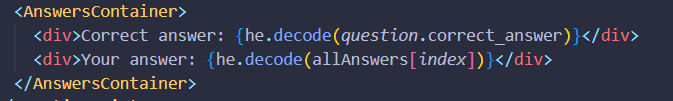
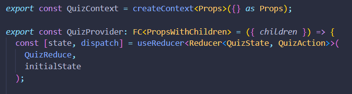
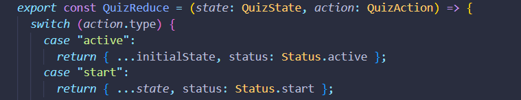
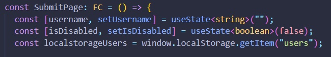

## THE TRIVIA PURSUIT QUIZ

Quiz App Overview
Description
The quiz app is designed to challenge users with 15 questions across three levels of difficulty: easy, medium, and hard. Players have a total of 90 seconds to answer all the questions. The app was built using create-react-app, TypeScript, and Styled Components. Additionally, the he library was utilized to decode HTML entities retrieved from an external API.

Key Features
Three Difficulty Levels:
✅Easy: Questions suitable for beginners.
✅Medium: Slightly more challenging questions.
✅Hard: For seasoned quizzers and experts.
Time Limit:
✅Users must answer all questions within 90 seconds.
State Management:
✅useState: Used to manage local component state.
✅useEffect: Handles side effects and data fetching.
✅useReducer: Manages complex state logic.
✅Context API: Provides global state management.
User Interaction:
Users select answers and progress through the quiz.
Scores are calculated based on the number of correct answers.
Users can check all answers at the end of the game.
Local Storage:
✅Usernames and scores can be stored in localStorage for future display or retrieval.
Technical Stack
✅Frontend Framework: React (created with create-react-app)
✅Language: TypeScript
✅Styling: Styled Components
✅HTML Entities Decoding: he library
✅State Management: useState, useEffect, useReducer, and Context API

